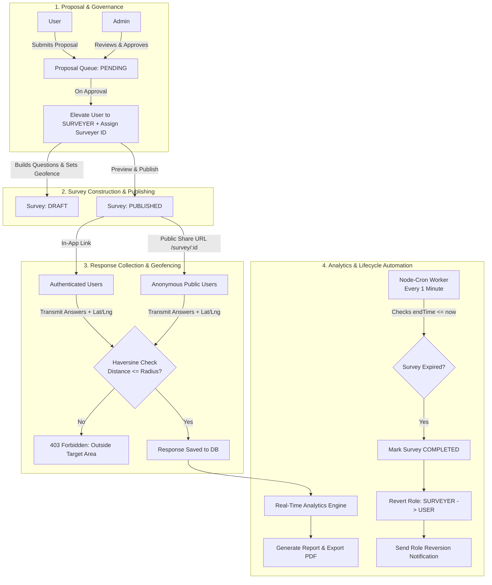

# 📍 GeoSurvey — Geo-Targeted Survey & Field Proposal Management System

[](https://reactjs.org/)
[](https://vitejs.dev/)
[](https://tailwindcss.com/)
[](https://nodejs.org/)
[](https://www.mongodb.com/)
[](LICENSE)

An enterprise-grade, full-stack **field research and geo-fenced survey management platform**. GeoSurvey introduces proposal-driven survey authoring, strict geographical boundary enforcement using the **Haversine formula**, dynamic time-bounded **Role-Based Access Control (RBAC)** with automated cron demotion, live statistical analytics, and one-click **PDF report compilation**.

---

## 📌 Table of Contents

- [Core Highlights](#-core-highlights)
- [Key Features](#-key-features)
  - [1. User Portal](#1-user-portal)
  - [2. Field Surveyor Workspace](#2-field-surveyor-workspace)
  - [3. Administrative Governance](#3-administrative-governance)
  - [4. Public Respondent Channel](#4-public-respondent-channel)
- [System Architecture & Workflow](#-system-architecture--workflow)
- [Tech Stack](#-tech-stack)
- [Project Directory Structure](#-project-directory-structure)
- [Getting Started](#-getting-started)
  - [Prerequisites](#prerequisites)
  - [1. Clone Repository](#1-clone-repository)
  - [2. Server Setup](#2-server-setup)
  - [3. Database Seeding](#3-database-seeding)
  - [4. Client Setup](#4-client-setup)
- [Environment Variables](#-environment-variables)
  - [Backend (`server/.env`)](#backend-serverenv)
  - [Frontend (`client/.env`)](#frontend-clientenv)
- [Default Demo Credentials](#-default-demo-credentials)
- [API Reference](#-api-reference)
- [Automated Lifecycle & Geofencing Math](#-automated-lifecycle--geofencing-math)
- [License](#-license)

---

## 🚀 Core Highlights

- **Proposal-Gated Authorization**: Regular users cannot launch surveys directly. They submit detailed field proposals (with location, duration, and objective) for administrative review.
- **Time-Bounded Surveyor Elevation**: Approved proposals promote the applicant to a `SURVEYER` role with a unique generated ID (e.g., `SVR-CHENNAI-1042`).
- **Precision Geofencing**: Submissions are strictly verified in real time against the survey epicenter coordinates and radius (1–100 km). Responses outside the geofence are rejected with `403 Forbidden`.
- **Autonomous Expiry Cron Worker**: A background scheduler runs every minute (`node-cron`), automatically marking elapsed surveys as `COMPLETED`, reverting the surveyor's role back to `USER`, and delivering in-app notifications.
- **Dual-Mode Participation**: Supports both authenticated in-app responses (with duplicate vote prevention) and anonymous public access links (`/survey/:surveyId`).
- **Real-Time Analytics & PDF Generation**: Instant percentage breakdowns, average rating computations, and downloadable executive PDF summaries built with `jsPDF` and `html2canvas`.

---

## ✨ Key Features

### 1. User Portal
- **Authentication**: Local email/password registration with Bcrypt hashing and JWT sessions, plus Google OAuth 2.0 single sign-on.
- **Proposal Submission**: Propose new survey initiatives with title, description, targeted city, latitude, longitude, and planned time window.
- **Proposal Status Tracking**: Real-time feedback on proposals (`PENDING`, `APPROVED`, `REJECTED` with admin rejection notes).
- **Survey Participation**: Discover active surveys within proximity and cast responses with coordinate verification.
- **In-App Notification Center**: Instant audit alerts for proposal approvals, rejections, and role reversions.

### 2. Field Surveyor Workspace
- **Survey Designer**: Form builder supporting diverse question types:
  - `SINGLE_CHOICE` (Radio options)
  - `MULTIPLE_CHOICE` (Multi-select checkboxes)
  - `YES_NO` (Boolean toggles)
  - `RATING` (1–5 scale metrics)
- **Geographic Configuration**: Configure city, latitude, longitude, and restriction radius ($km$).
- **Live Preview & Publishing**: Validate surveys through a live preview modal before transitioning from `DRAFT` to `PUBLISHED`.
- **Shareable Direct Link**: Instant generation of public survey URLs (`/survey/:surveyId`) for field deployment.
- **Live Analytics Dashboard**: Visual distribution charts, completion counters, and question-by-question metrics.
- **Report & PDF Export**: Compile survey results into formatted analytical reports and download client-side generated PDFs.

### 3. Administrative Governance
- **Proposal Queue**: Filter, inspect, approve, or reject incoming survey proposals with mandatory justification notes.
- **Dynamic Surveyor ID Generation**: Automatically allocates formatted identifiers based on city and database sequences upon approval.
- **Global Survey Monitoring**: Live system-wide oversight of active surveys, conducting indicators, and real-time response counters.
- **User Account Management**: Directory of all registered users, roles, authentication providers, and surveyor clearance statuses.
- **Central Report Archive**: Read-only repository of all completed and submitted field reports.

### 4. Public Respondent Channel
- **Zero-Friction Access**: Clean, standalone interface allowing anonymous users to participate via direct link without logging in.
- **Client & Server Geo-Verification**: Requests browser location coordinates and validates distance against the survey boundary before submission.

---

## 🏗 System Architecture & Workflow



---

## 💻 Tech Stack

### Frontend
- **Framework**: [React 19](https://react.dev/) + [Vite 8](https://vitejs.dev/)
- **Styling**: [Tailwind CSS v4](https://tailwindcss.com/)
- **Routing**: [React Router DOM v7](https://reactrouter.com/)
- **Animations & Interaction**: [GSAP 3](https://greensock.com/gsap/)
- **HTTP Client**: [Axios](https://axios-http.com/) with request/response token interceptors
- **Document Export**: [jsPDF](https://github.com/parallax/jsPDF) & [html2canvas](https://html2canvas.hertzen.com/)

### Backend
- **Runtime**: [Node.js](https://nodejs.org/)
- **Framework**: [Express 5](https://expressjs.com/)
- **Database**: [MongoDB](https://www.mongodb.com/) with [Mongoose 9](https://mongoosejs.com/)
- **Validation**: [Zod 4](https://zod.dev/) for payload sanitization
- **Security & Auth**: [JSON Web Tokens (JWT)](https://jwt.io/) & [Bcrypt.js](https://www.npmjs.com/package/bcryptjs)
- **Task Scheduling**: [Node-Cron 4](https://www.npmjs.com/package/node-cron)

---

## 📂 Project Directory Structure

```text
survey-system/
├── client/                     # Frontend Application (React 19 + Vite)
│   ├── public/                 # Static assets
│   ├── src/
│   │   ├── api/                # Configured Axios instance with auth interceptors
│   │   ├── assets/             # Images, logos, and vector illustrations
│   │   ├── components/         # Reusable UI elements (Navbar, Sidebar, Modals, ErrorBoundary)
│   │   ├── pages/
│   │   │   ├── AdminDashboard.jsx      # Admin panel for proposals, surveys, reports, users
│   │   │   ├── SurveyerDashboard.jsx   # Surveyor suite: question builder, stats, PDF reports
│   │   │   ├── UserDashboard.jsx       # User view: proposal submission, available surveys
│   │   │   └── PublicSurvey.jsx        # Standalone public survey participation view
│   │   ├── styles/             # Modular CSS animations and themes
│   │   ├── App.jsx             # Route definitions and RBAC guard wrappers
│   │   ├── login.jsx           # Dual-tab login & registration with Google Auth
│   │   └── main.jsx            # React root mount
│   ├── index.html
│   ├── vite.config.js          # Vite configuration with /api reverse proxy
│   └── package.json
│
└── server/                     # Backend API (Node.js + Express + MongoDB)
    ├── config/                 # Database connection (Mongoose)
    ├── controllers/            # Route business logic
    │   ├── adminController.js      # Proposal approvals, user directories, global surveys
    │   ├── analyticsController.js  # Metric calculations and response aggregations
    │   ├── authController.js       # Register, login, Google OAuth, profile update
    │   ├── proposalController.js   # Field proposal creation and surveyor elevation
    │   ├── publicController.js     # Public access endpoints
    │   ├── reportController.js     # Analytical report persistence and submissions
    │   ├── responseController.js   # Response intake with Haversine geofence validation
    │   └── surveyController.js     # Survey CRUD, draft states, and publishing
    ├── middleware/             # JWT authentication and RBAC authorization guards
    ├── models/                 # Mongoose schemas (User, Survey, Proposal, Response, Report, Notification)
    ├── routes/                 # Express REST endpoint declarations
    ├── services/
    │   └── surveyExpiryJob.js  # Node-cron background worker for auto-expiration
    ├── utils/                  # Haversine distance, token generator, ID builders
    ├── Validators/             # Zod input validation schemas
    ├── app.js                  # Express middleware pipeline assembly
    ├── server.js               # Database connect, cron initialization, and HTTP listener
    ├── seed.js                 # Database seeder for demo accounts
    └── package.json
```

---

## ⚡ Getting Started

### Prerequisites
- **Node.js**: v18.0.0 or higher
- **npm**: v9.0.0 or higher
- **MongoDB**: Local instance running or a MongoDB Atlas cluster URI

---

### 1. Clone Repository

```bash
git clone https://github.com/vijayadharan21-creator/survey-system.git
cd survey-system
```

---

### 2. Server Setup

Navigate into the `server` directory and install dependencies:

```bash
cd server
npm install
```

Create a `.env` file in the `server` directory:

```env
PORT=5000
MONGO_URI=mongodb+srv://<username>:<password>@<cluster>.mongodb.net/Survey?retryWrites=true&w=majority
JWT_SECRET=your_super_secure_jwt_secret_key_2026
JWT_EXPIRES_IN=1d
```

Start the backend in development mode:

```bash
npm run dev
# Server running on http://localhost:5000
```

---

### 3. Database Seeding

Initialize the database with default Admin and Surveyor accounts:

```bash
node seed.js
```

---

### 4. Client Setup

In a new terminal window, navigate into the `client` directory and install dependencies:

```bash
cd client
npm install
```

Create a `.env` file in the `client` directory:

```env
VITE_GOOGLE_CLIENT_ID=your_google_oauth_client_id.apps.googleusercontent.com
```

Start the Vite development server:

```bash
npm run dev
# Frontend accessible at http://localhost:5173
```

The frontend includes a pre-configured reverse proxy inside `vite.config.js` pointing `/api` calls directly to `http://localhost:5000`.

---

## 🔐 Environment Variables

### Backend (`server/.env`)

| Variable | Required | Description | Example |
| :--- | :---: | :--- | :--- |
| `PORT` | Optional | Port for the Express server (default: `5000`) | `5000` |
| `MONGO_URI` | **Yes** | MongoDB connection string (Atlas or local) | `mongodb://localhost:27017/survey` |
| `JWT_SECRET` | **Yes** | Cryptographic key used to sign JWT tokens | `survey_jwt_secret_key` |
| `JWT_EXPIRES_IN` | Optional | Expiration window for signed JWTs | `1d` |

### Frontend (`client/.env`)

| Variable | Required | Description | Example |
| :--- | :---: | :--- | :--- |
| `VITE_GOOGLE_CLIENT_ID` | Optional | Google Cloud Console OAuth 2.0 Web Client ID | `xxxx.apps.googleusercontent.com` |

---

## 🔑 Default Demo Credentials

Run `node seed.js` in the `server/` directory to create these pre-configured test users:

| Role | Email | Password | Identifier / Clearance |
| :--- | :--- | :--- | :--- |
| **Admin** | `vijayadmin@gmail.com` | `12345678` | Full system governance |
| **Surveyer** | `vijaysruvary@gmail.com` | `12345678` | `SVR-SEED-001` (ACTIVE) |

> 💡 *Note: To test the end-to-end promotion lifecycle, register a new account on the portal as a regular user, submit a proposal, approve it from the Admin account, and witness the automated role elevation.*

---

## 📡 API Reference

### Authentication (`/api/auth`)
| Method | Endpoint | Access | Description |
| :--- | :--- | :--- | :--- |
| `POST` | `/api/auth/register` | Public | Create a new user account |
| `POST` | `/api/auth/login` | Public | Authenticate via local credentials or Google OAuth |
| `GET` | `/api/auth/profile` | Private | Retrieve authenticated user profile |
| `PUT` | `/api/auth/profile` | Private | Update user display details |

### Proposals (`/api/proposals`)
| Method | Endpoint | Access | Description |
| :--- | :--- | :--- | :--- |
| `POST` | `/api/proposals` | User / Surveyer | Submit a new field survey proposal |
| `GET` | `/api/proposals/my` | User / Surveyer | List own submitted proposals |
| `POST` | `/api/proposals/:id/start-survey`| User / Surveyer | Initialize survey draft for approved proposal |

### Surveys (`/api/surveys`)
| Method | Endpoint | Access | Description |
| :--- | :--- | :--- | :--- |
| `POST` | `/api/surveys` | Surveyer | Create survey draft with geofence and questions |
| `GET` | `/api/surveys/my` | Surveyer | Fetch surveyor's active survey details |
| `PUT` | `/api/surveys/:id` | Surveyer | Update draft question set and parameters |
| `GET` | `/api/surveys/:id/preview` | Surveyer | Preview survey questions and layout |
| `PATCH`| `/api/surveys/:id/publish` | Surveyer | Publish survey for active fieldwork |
| `GET` | `/api/surveys/available` | User | List all active surveys eligible for participation |
| `GET` | `/api/surveys/:id/participate` | User | Fetch survey questions for authenticated respondent |
| `GET` | `/api/surveys/my-history` | Private | View historical survey participation or drafts |

### Responses & Geofenced Submissions (`/api`)
| Method | Endpoint | Access | Query Params | Description |
| :--- | :--- | :--- | :--- | :--- |
| `POST` | `/api/surveys/:id/responses` | User | `lat`, `lng` | Submit answers (verified against geofence) |

### Public Participation (`/api/public`)
| Method | Endpoint | Access | Description |
| :--- | :--- | :--- | :--- |
| `GET` | `/api/public/surveys/all` | Public | List all active public surveys |
| `GET` | `/api/public/surveys/:surveyId` | Public | Retrieve public survey form by ID |
| `POST`| `/api/public/surveys/:surveyId/respond`| Public | Submit responses anonymously with coordinate validation |

### Analytics & Reports (`/api`)
| Method | Endpoint | Access | Description |
| :--- | :--- | :--- | :--- |
| `GET` | `/api/surveys/:id/analytics` | Surveyer / Admin | Fetch real-time statistical breakdowns |
| `POST` | `/api/surveys/:id/report` | Surveyer | Generate consolidated analytical report |
| `PATCH`| `/api/reports/:id/submit` | Surveyer | Finalize and submit report to admin queue |
| `GET` | `/api/reports/my` | Private | List surveyor's generated reports |
| `GET` | `/api/reports/:id` | Private | Inspect specific report details |

### Admin Operations (`/api/admin`)
| Method | Endpoint | Access | Description |
| :--- | :--- | :--- | :--- |
| `GET` | `/api/admin/proposals` | Admin | Retrieve all proposals across the system |
| `PATCH`| `/api/admin/proposals/:id/approve` | Admin | Approve proposal and elevate applicant to surveyor |
| `PATCH`| `/api/admin/proposals/:id/reject` | Admin | Reject proposal with required reason string |
| `GET` | `/api/admin/surveys` | Admin | System-wide view of all active surveys and live counters |
| `GET` | `/api/admin/users` | Admin | Retrieve entire user directory and role statuses |
| `GET` | `/api/admin/reports` | Admin | Inspect all finalized field reports |

---

## 📐 Automated Lifecycle & Geofencing Math

### Geofencing Distance Computation
GeoSurvey enforces geographical validation using the great-circle **Haversine formula**:

$$\Delta\sigma = 2 \arcsin\left( \sqrt{\sin^2\left(\frac{\Delta\phi}{2}\right) + \cos(\phi_1)\cos(\phi_2)\sin^2\left(\frac{\Delta\lambda}{2}\right)} \right)$$

$$d = R \cdot \Delta\sigma$$

Where:
- $\phi_1, \phi_2$ = latitudes in radians
- $\Delta\phi$ = difference in latitude
- $\Delta\lambda$ = difference in longitude
- $R$ = Earth's mean radius ($6371 \text{ km}$)

If the computed distance $d > \text{radius}$, the server immediately aborts the submission.

### Autonomous Cron Demotion
The background worker (`server/services/surveyExpiryJob.js`) polls every minute:
1. Queries all `PUBLISHED` surveys where `endTime <= new Date()`.
2. Marks the survey as `COMPLETED`.
3. Flips associated proposal status to `COMPLETED`.
4. Reverts the owner user's role from `SURVEYER` back to `USER`.
5. Logs an in-app audit notification into the database alerting the user of their role expiration.

---

## 📄 License

Distributed under the **MIT License**. See `LICENSE` for more details.
